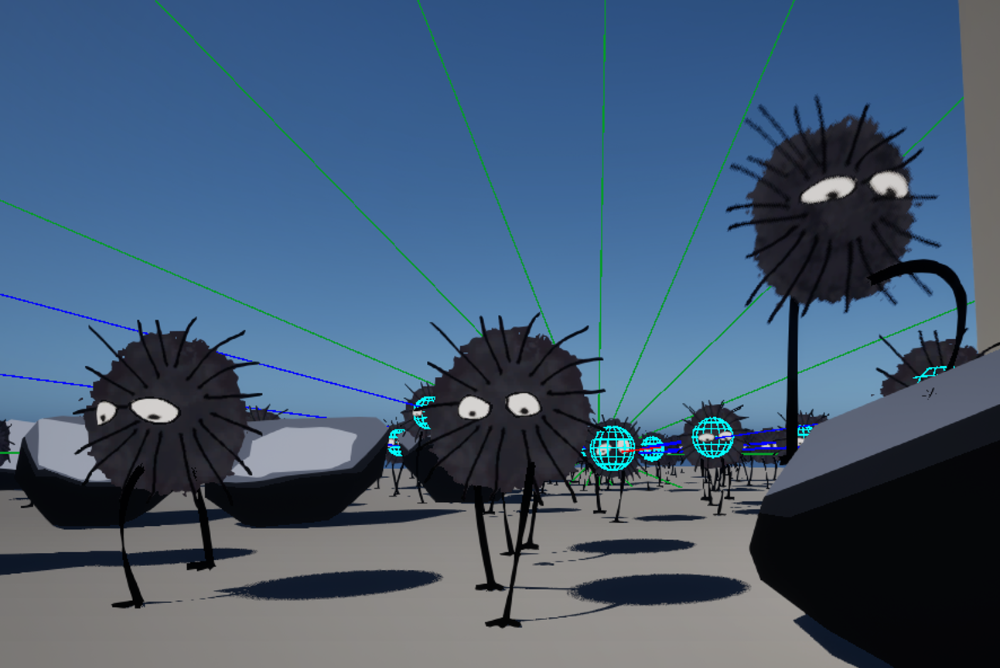

# Spirited Away-Inspired Unreal Demo

I'm putting together this demo to combine all of the skills I gained working as a professional Unreal programmer (AI, high entity count sim, procedural meshing, procedural animation, physics, SIMD, multithreading, gameplay) and combine it with a creative work I love: Spirited Away.

It's pretty ugly at the moment, but I will create a video after the Soot Sprite behaviors are more interesting, and before the visual style is nailed down.

I plan to have >= 1000 sutawari simulating all at once.

## Progress

- [x] spring-based sutawari body locomotion
- [x] legs + feet mesh animated procedurally via material and environmental collision
- [x] eyes animate and look at things (currently looktargets are disabled)
- [x] sutawari vision updated with SIMD (20x time reduction compared to box overlaps)
- [ ] allow sutawari to carry rocks (higher weight = harder to carry)
- [ ] put job system into motion on worker threads, begin heavy cpu jobs there
- [ ] multithreaded pathfinding over dynamic terrain (oof)
- [ ] implement GOAP-based motivation planning (go to rock, pick up rock, drop rock off cliff, pick up star, scamper away, etc.)
- [ ] implement player character (first person with invisible body but shadowed footsteps; crouch, throw stars, pick up and throw rocks, sutawari avoid feet)
- [ ] implement emotional motivations and responses in sutawari
- [ ] make a visuals todo and start working on the visuals
